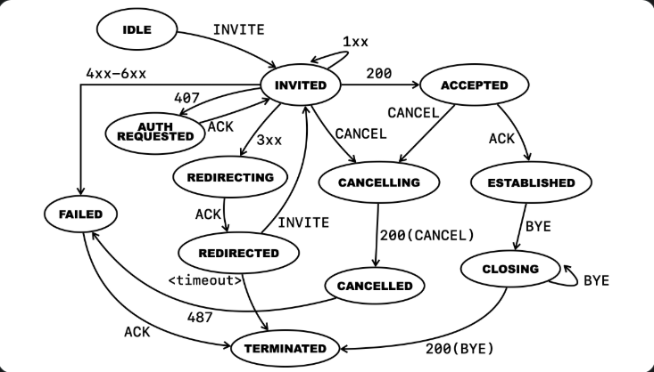

## 요구사항
  
위 다이어그램을 구현하기


예상결과 및 동작예시  
예시1)  
입력 ["INVITE", "CANCEL", "200(CANCEL)", "487", "ACK"]  
출력 ["INVITED", "CANCELLING", "CANCELLED", "FAILED", "TERMINATED"]  

## 제약사항
- 상태와 이벤트 값을 상수로 선언한다. (반복되는 하드코딩 x)
- 상태와 이벤트 값의 비교를 비교문에서 직접 비교하지 말고,  
  자신이 선택한 상태 전환을 위한 FROM-TO 상태 데이터 구조를 설계하고 구현

## 고민
FROM-TO 데이터 구조  
현재 상태(From) 과 다음 상태(To) 를 데이터 만으로 선언해 두고  
코드에서 이 표를 조회해 전이를 결정하는 방식
```
// 타입 정의 (TypeScript 표기지만 JS로 그대로 동작)
type Transition = {
  from  : State;                        // 현재 상태
  to    : State;                        // 다음 상태
  match : (event: number) => boolean;   // true면 이 전이 사용
};

const TRANSITIONS: Transition[] = [
  {                                         // ① INVITED + 407 → AUTH_REQUESTED
    from : STATE.INVITED,
    to   : STATE.AUTH_REQUESTED,
    match: code => code === EVT.AUTH_REQUEST
  },
  {                                         // ② INVITED + 4xx/5xx/6xx → FAILED
    from : STATE.INVITED,
    to   : STATE.FAILED,
    match: code => {
      const cls = Math.floor(code / 100);   // 400 → 4, 503 → 5 …
      return cls >= 4 && cls <= 6;
    }
  },
];
```  
이런 형식의 코드

복잡하게 생각하지말고 진입점은 어떻게 받을지 고민  
이후 상태로 가기위해 필요한 것  
- 현재 상태
    - 반환값으로 받아야함
- 이벤트
    - 입력 배열로 받게 됨


함수의 형태
```
function move(curState, event) {

}
```
from-to 데이터 구조에서 탐색 순서  
1. curState 와 일치하는 요소 탐색
2. 해당 요소 내부의 event 와 일치한다면 to 반환
```
const fromTo = [
    {
        from: 'INVITED',
        to: 'AUTH_REQUESTED',
        code: EVENT.INVITE,
    },
    {
        ~
    }
]
```
상태와 이벤트 값을 상수로 선언한다. (반복되는 하드코딩 x)  
외부에 상수로 선언하고 속성을 통해 받아오는 것으로 변경
```
function next(param0) {
    const STATE = Object.freeze({
        IDLE: 'IDLE',
        INVITED: 'INVITED',
        AUTH_REQUESTED: 'AUTH REQUESTED',
        REDIRECTING: 'REDIRECTING',
        REDIRECTED: 'REDIRECTED',
        CANCELLING: 'CANCELLING',
        CANCELLED: 'CANCELLED',
        ACCEPTED: 'ACCEPTED',
        ESTABLISHED: 'ESTABLISHED',
        CLOSING: 'CLOSING',
        FAILED: 'FAILED',
        TERMINATED: 'TERMINATED'
    });

    const EVENT = Object.freeze({
        INVITE: 'INVITE',
        CANCEL: 'CANCEL',
        ACK: 'ACK',
        BYE: 'BYE',
        TIMEOUT: '<timeout>',
        C_200: '200',
        C_200_CANCEL: '200(CANCEL)',
        C_200_BYE: '200(BYE)',
        C_407: '407',
        C_487: '487',
        C_1XX: '1xx',
        C_3XX: '3xx',
        C_4XX_6XX: '4xx-6xx'
    });

    let curState;

    const state = [
        {
            from: STATE.IDLE,
            to: STATE.INVITED,
            code: code: EVENT.INVITE
        },
```

event 가 범위형식으로 되어있으면 어떻게 찾아야 할까  
속성값에 범위를 넣을 수는 없을까 -> event 는 함수로 구현하자
함수로 처리하게 되면 다향한 값의 code 처리가 가능하다  
의 흐름으로 아래와 같이 했었으나
```
const fromTo = [
    {
        from: 'INVITED',
        to: 'AUTH_REQUESTED',
        event: e => e === '407',
    },
    {
        f~,
        t~,
        event: e => {
            const code = Number(e);
            return code >= 400 && code < 700;
        }
    }
]
```
상태와 이벤트 값의 비교를 비교문에서 직접 비교하지 말고
의 제약조건으로 위의 해결법은 x
비교문을 안 쓰려면 어떻게 해야할까? -> 답은 Map 밖에 생각나지 않음

from 값으로 첫 요소 조회하기에 Map<from, ?> 형태로 맵을 만들어야함  
value 에는 배열로 넣을까 고민하였으나 배열로 넣으면 결국 비교연산자 사용하게 됨  
Map<from, Map<?, ?>> 2번째 Map 은 키를 뭘로 해야하나 고민   
from 으로 내부 요소를 찾았다면 해당 상태의 이벤트에 따라 to 가 정해짐
Map<from, Map<event, to>> 형식으로 결정  
```
const stateMap = (() => {
    const m = new Map();

    for (const { from, to, event } of TRANSITIONS) {
        if (!m.has(from)) {
            m.set(from, new Map());
        }
        m.get(from).set(event, to);
    }

    return m;
})();
```  
stateMap 에 담고 from 으로 찾고 그 뒤에 event 값 매칭을 시켜서 뽑아 오면 된다  
상태와 이벤트 값의 비교를 비교문에서 직접 비교하지 말고 조건 만족  
입력으로 들어오는 event 값들은 EVENT 객체의 속성값과 비교해서 가공한다
```
/**
 * 외부에서 받은 문자열을 EVENT 상수로 변환한다
 * @param {string} raw - 이벤트값
 * @returns {string} - 매핑된 EVENT 상수 또는 원본 문자열
 */
function normalizeEvent(raw) {
    if (EVENT[raw]) return EVENT[raw];

    if (/^\d{3}$/.test(raw)) {
        const n = Number(raw);
        if (n === 200) return EVENT.C_200;
        if (n === 407) return EVENT.C_407;
        if (n === 487) return EVENT.C_487;
        if (n >= 100 && n <= 199) return EVENT.C_1XX;
        if (n >= 300 && n <= 399) return EVENT.C_3XX;
        if (n >= 400 && n <= 699) return EVENT.C_4XX_6XX;
    }

    if (raw === '200(CANCEL)') return EVENT.C_200_CANCEL;
    if (raw === '200(BYE)') return EVENT.C_200_BYE;

    return raw;
}
```
이후 원본문자열에서 다음 상태를 꺼내 저장하는데  
상태값이 변하지 않는경우 중복기록하지 않는다  
```
/**
 * stateMap 에서 각 키에 맞는 값을 꺼냄
 * @param {string} from - 현재 상태값
 * @param {string} rawEv - 원본 이벤트 문자열
 * @returns - 
 */
function move(from, rawEv) {
    const ev = normalizeEvent(rawEv);
    return stateMap.get(from).get(ev);
}

/**
 * 이벤트 진행후에도 원래 상태가 나오면 중복기록하지 않고
 * 상태가 바뀔때만 기록합니다
 * @param {Array} param0 - 원본 이벤트 문자열이 담긴 배열 
 * @param {Array} track - 지나간 상태를 기록할 배열
 */
function dupCheck(param0, track) {
    for (e of param0) {
        const curState = track.pop();
        const nextState = move(curState, e);
        if (curState === nextState) {
            track.push(nextState);
        } else {
            track.push(curState);
            track.push(nextState);
        }
    }
}

function next(param0) {
    const track = ['IDLE'];

    dupCheck(param0, track);

    track.shift();

    return track;
}
```
## 느낀점
데이터와 로직을 분리한 덕분에 입력 실수가 있었지만  
함수부분 건들일 필요없이 데이터 부분만 고쳐주면 되었다  
데이터는 데이터만 로직은 로직만 두는 구조가 유지보수 측면에서 큰 이점을 준다는 걸 체감했다  
관심사 분리가 얼마나 중요한지 알게된 부분이였다  
적절한 모듈화를 하고 있는지 매번 신경써야겠다
