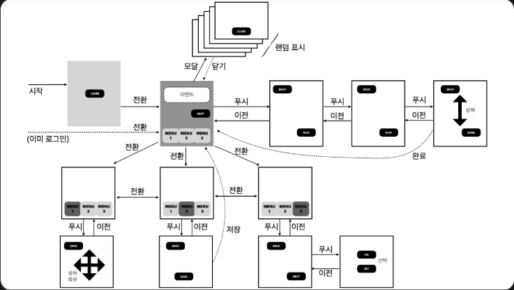

## 요구사항

<br>위와 같은 흐름으로 동작하는 서비스의 사용자 이력을 저장하기 위한 데이터 구조와 저장하는 프로그램 구조를 설계하고 설명</br>

1. 하루 동안 얼마나 많은 사용자들이 <로그인 화면>에 접속하는가

    userId 외래키 설정, Page 관련 컬럼생성
2. <이벤트 광고> 화면을 가장 많이 본 사용자는 누구인가

    durationSeconds 관련 컬럼생성

3. <메인 화면>을 가장 많이 보는 시간대는 하루 중에 언제인가

    2번 조건과 관련해서 inTime, outTime 을 DateTime 테이블로 생성

4. 메뉴 1-2-3 화면 중에서 가장 전환을 많이하는 화면은 어디서/어디로 전환하는 경우인가.

    1번 조건과 관련해서 prePage, curPage 컬럼 생성

5. 지난 일주일 동안 메뉴 2 마지막 화면에서 값을 저장하고 <메인 화면>으로 이동한 횟수는 몇 번인가

    사용자가 menu 2 마지막화면에서 값을 저장하는 api 를 호출한 횟수를 저장하는 컬럼 필요  
    -> User 테이블에 menu2SaveCount 를 추가하려하였으나 '지난 일주일' 기간확인이 필요함

    pageAction 테이블을 만들어서 action 을 기준으로 일어난 시각을 기록해야겠다.

    이제 pageAction 테이블에서 일주일 기간과 값을 저장한 액션을 기준으로 쿼리를 보내면  
    요구한 데이터 출력가능


6. 하루 동안 메뉴 3 마지막 화면에서 ON/OFF 설정을 선택한 사용자는 몇 명인가

    메뉴 3 마지막 화면의 ON/OFF 설정은 사용자 개인설정인 것으로 추측
    설정값이 바뀔때 시간을 기록하는 컬럼을 user 테이블에 생성

7. 최근 일주일 기간에 가장 화면 노출이 적은 화면은 어느 화면인가

    위에서 생긴 curPage 와 durationSeconds 를 curPage 기준 GROUP BY 로 묶어 조회
    추가 컬럼 필요 x
---
## PageView 모델
| 필드명             | 타입       | 설명           |
| --------------- | -------- | ------------ |
| id              | Int      | 기본 키, 자동 증가  |
| prePage         | PageName   | 이전 화면 이름     |
| curPage         | PageName   | 현재 화면 이름     |
| inTime          | DateTime | 화면 진입 시각     |
| outTime         | DateTime | 화면 종료 시각     |
| durationSeconds | Int      | 화면 머문 시간 (초) |
| userId          | BigInt   | User와의 외래키   |
| user            | User     | User 모델과의 관계 |
> 해당 테이블에서는 페이지 푸시, 전환에 관련된 데이터를 수집 보관한다  
prePage, curPage 컬럼을 통해 페이지 이동과 체류중인 페이지를 확인 가능하고  
durationSeconds 같은 경우는 체류시간 조회가 빈번하게 이루어 질거 같아 컬럼에 추가  
inTime, outTime 은 시간대 확인을 위한 컬럼이고 어떤 User 의 정보인지 표현하기 위해 관계성 추가 
## PageAction 모델
| 필드명    | 타입         | 설명                    |
| ------ | ---------- | --------------------- |
| id     | Int        | 기본 키, 자동 증가           |
| page   | PageName     | 동작이 발생한 화면 이름         |
| action | ActionType | 수행한 동작(SAVE, ON, OFF) |
| time   | DateTime   | 동작이 발생한 시각            |
| userId | BigInt     | User와의 외래키            |
| user   | User       | User 모델과의 관계          |
> 5번 조건 처리를 위해 페이지 별 Action 이 발생한 시점과, 동작유형의 정보를 담는 테이블  
변경이 일어날때마다 레코드가 쌓이게 된다.  
행위와 관련된 정보들을 읽을 수 있는 테이블  
action 컬럼같은 경우에는 값을 ENUM 으로 설정해 오타나 잘못된 값 설정을 방지한다


### PageAction ENUM
| 값    | 설명                  |
| ---- | ------------------- |
| SAVE | 저장 버튼 클릭        |
| ON   | 마지막 화면에서 ON 선택  |
| OFF  | 마지막 화면에서 OFF 선택 |

### PageName ENUM
```
enum PageName {
    MENU1_0
    MENU2_0
    MENU3_0
    MENU1_1
    MENU2_1
    MENU3_1
    MENU3_2
    AD_EVENT_0
    AD_EVENT_1
    AD_EVENT_2
    AD_EVENT_3
    AD_EVENT_4
    CONTENTS_0   
}
```
> Action 값은 정해진 값중 하나이기 때문에 정합성과 쿼리 작성시의 편의를 위해 ENUM 사용  
아래의 PageName 같은경우도 마찬가지 이유로 적용

> 페이지 조회이력과 행동이력을 분리  
PageView 는 사용자가 화면에 진입, 이탈 할때마다 기록되는 데이터로 발생 빈도가 매우 높아 대용량 테이블이 될 예정이다
PageAction 은 저장, 상태변경 등 View 에 비해 적은 횟수로 발생하는 이벤트만 저장  
이러한 분리로 예상되는 효과로는 행동패턴을 분석할 때 대량의 조회 이벤트 데이터와 불필요하게 JOIN 하지 않아도 되고 단일 테일블 보다 훨씬 가볍고 빠르게 원하는 Action 데이터만 집계가 가능하다는 장점들이 있다